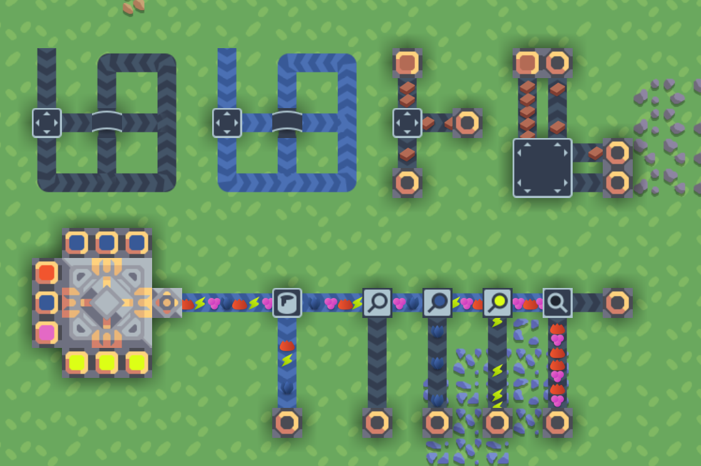

# Fresh Theme for Mindustry

A modern, minimalist Mindustry skin with a focus on clarity and readability.

Work in progress.

# Distribution

Currently, only distribution blocks are skinned (everything else falls back to default Mindustry look).

- Thinner conveyors: makes it easier to see where the belt input is coming from
- Clearly distinguished blocks: unlike the default look, where the sorter & overflow gate basically look the same
- Meaningful features: makes it easy to see & remember what's going on (e.g. junction is a smol bridge)